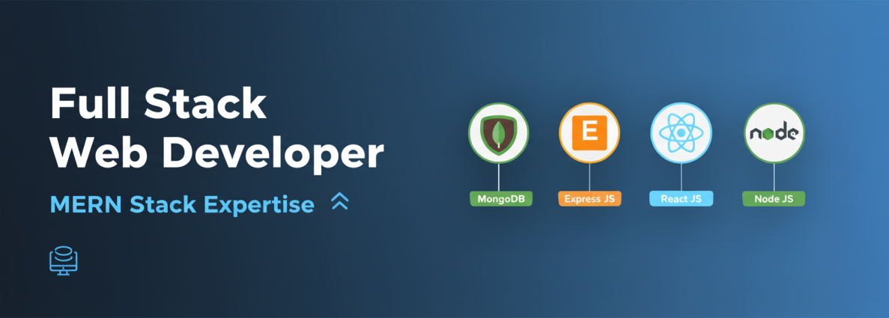

# 👋 Hi there, I'm **Sumon Kaysar**

---

## 🚀 About Me

I’m a **passionate Web Developer** who loves building **modern, responsive, and user-friendly web applications**. My goal is to become a **full-stack developer** and work on projects that solve real-world problems.

- 🔭 I’m currently working on [PayBondhu (A Digital Wallet)](https://github.com/sumonkaysar/PayBondhu-client)

- 🌱 I’m currently learning **PostgreSQL**

- 👨‍💻 All of my projects are available at [https://sumonkaysar.vercel.app/](https://sumonkaysar.vercel.app/)

- 💬 Ask me about **React.js, TypeScript, JavaScript, Node.js, Express.js**

- 📫 How to reach me **sumon.kaysar.sk@gmail.com**

- 📄 Know about my experiences from [My Resume](https://drive.google.com/file/d/11H_EHikXboxbGNzW0nLQpFDltxiTBVW2/view?usp=drive_link)

💡 **Vision:** To create impactful digital solutions that make people's lives easier.

---

## 🧑‍💻 What I Do

- 🌐 **Web Development** – Building responsive websites and dynamic dashboards
- ⚡ **Frontend Development** – Crafting seamless UIs with **React.js**
- 🛠 **Backend Development** – Developing RESTful APIs with **Node.js & Express.js**
- 🗄 **Database Management** – Working with **MongoDB** and **MySQL**

---

## 🛠 Tech Stack

| **Category** | **Technologies** |
|---------------|------------------|
| **Frontend** |          |
| **Backend** |      |
| **Database** |   |
| **Tools** |       |                            |

---

## 📊 GitHub Stats:
 
 

---

<!-- ## 📌 Pinned Projects

### [💸 PayBondhu – Digital Wallet App](https://github.com/sumonkaysar/PayBondhu-client)

> A **digital wallet system** built using **React, Node.js, Express, and MongoDB** with multi-role authentication and transaction management.

### [📊 Statify Dashboard](https://github.com/sumonkaysar/statify-dashboard)

> A **data analytics dashboard** for visualizing statistics and insights using **React, Chart.js, and Tailwind CSS**.

### [🌐 Portfolio Website](https://github.com/sumonkaysar/portfolio)

> My **personal developer portfolio** showcasing my projects, skills, and achievements.

--- -->

## 🌐 Connect With Me

    
    
    
    
    
    
    
    
    

---

## 🏆 GitHub Trophies

---

### 🔝 Top Contributed Repo

---

### ✍️ Random Dev Quote

---

💡 _"Code. Learn. Build. Repeat."_